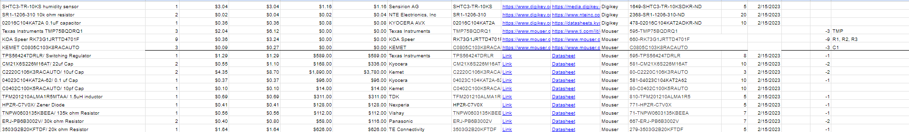
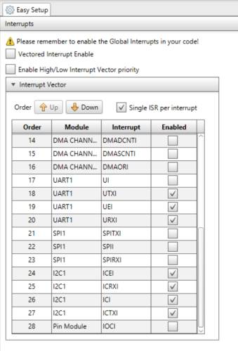
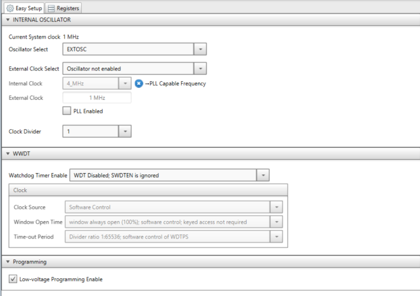
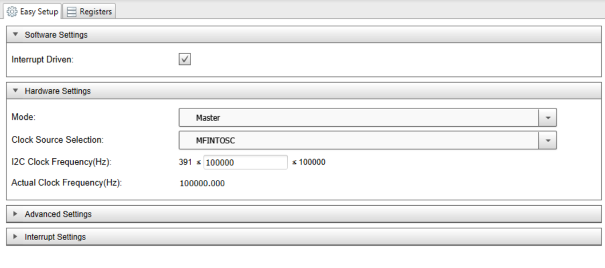
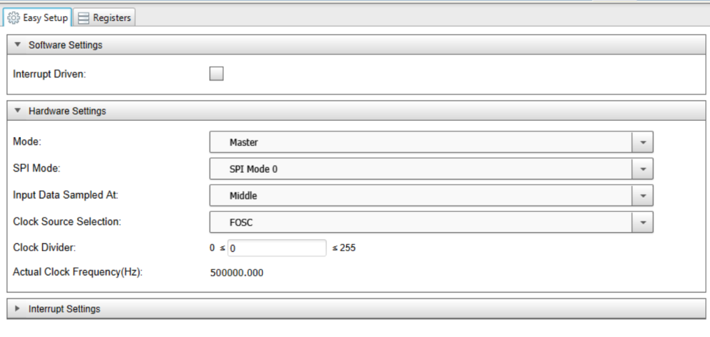
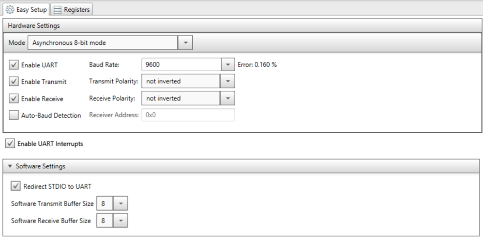

**Appendix A: Team Organization**

Communication Procedures

1. Meetings are preferred in person to discuss the objectives of the project as well as future meetings in advance. Texting group chats will be the primary form of communication. Discord will be used as the secondary form of communication. 

2. (Jedriq Ventura) is the designated communicator between his group and the instructor. He will relay messages from the instructor and write down what was relayed to him, then transfer the information via text or in-person to the group members. As well using discord to communicate information between members. 

3. Contingency plan for the project’s success would have each subsystem assigned a ‘secondary’ partner that can help in case of problems that may arise.

Meeting Schedule

 *Table 12*
 *Meeting Schedule*

Team Coordination

1. We will use text messages or text-group chats to remind ourselves of the meetings and the time they will occur.

2. If the event of a time change is to occur, we will notify via text messages, or use discord messages if the individual cannot be reached via text message. 

3. The preferred format of the meeting would be in Person and or communicating via discord.

4. If the meeting is cut-short or has ended earlier for a group member that had a prior engagement in another group or school-related activity, we as the attending members will summarize the topics discussed and relay the information back to the group member in a timely and orderly manner, this can be done either via text or email documenting.

**Appendix B: Final Design CAD Model**

**Appendix C: Microcontroller Selection**

Rationale: The reason for this is because of the cost of the part compared to the rest. And that the component had covered most of the requirements needed. This allows it to be more flexible with conversion between SPI and I2C. 

**Appendix D: BOM**

**Appendix E: MCC and Code**
Group Final Code:

#include "mcc_generated_files/mcc.h"

#include <stdio.h>

#include <stdint.h>

#include <stdbool.h>

#include "mcc_generated_files/i2c1_master.h"

#include <string.h>

#include "mcc_generated_files/mcc.h"

#include "mcc_generated_files/uart1.h"

#include "mcc_generated_files/examples/i2c1_master_example.h"

/*

                         Main application
                         
 */
 
char receive[100];

char dir1[100];

char dir2[100];

volatile uint8_t words; 

float values;

int ii;

volatile uart1_status_t rxStatus;

double Temp = 0;

double Hum = 0;

uint8_t dbuff[8];

uint8_t sbuff[8];

uint16_t tconv = 0;

uint16_t hconv = 0;

void UART1_Recieve_ISR(void) {

    UART1_Receive_ISR();
    
    if (UART1_is_rx_ready()) {
    
        words = UART1_Read();
        
    }
    
    if (UART1_is_tx_ready()) {
    
        LED_Toggle();
        
        UART1_Write(words);
        
    }
    
}

void main(void)

{

    // Initialize the device
    
    SYSTEM_Initialize();
    
    UART1_Initialize();
    
    SPI1_Initialize();
    
    INTERRUPT_GlobalInterruptEnable();
    
    UART1_SetRxInterruptHandler(UART1_Recieve_ISR);
    
    while (1)
    
    {
    
            dir1[0] = 0b11001111;
            
            dir2[0] = 0b11001101;
            
        //we want to trigger the chip to take a 'measurement' and wait for that to happen;
        
        I2C1_ReadNBytes(0x37, dbuff, 1);
        
        __delay_ms(100);
        
        I2C1_ReadNBytes(0x70, sbuff, 1);
        
        __delay_ms(100); 
        
        I2C1_ReadNBytes(0x37, dbuff, 8);
        
        __delay_ms(100);
        
        I2C1_ReadNBytes(0x70, sbuff, 8);
        
        tconv = (dbuff[0] << 8 | dbuff[1]) & 0x7F;
        
        hconv = (sbuff[0] << 8 | sbuff[1]) & 0x70;
        
        Hum = (hconv/65536.0);
        
        Temp = (tconv * 0.625);
        
        printf("The Temperature is %f %% \r\n", Temp);
        
        printf("The Humidity is %f %% \r\n", Hum);
        
      if(Temp<=80) { 
      
        SPI1_Open(SPI1_DEFAULT);
        
        ss_pin_SetLow();
        
        printf("Send: %s\r\n",dir1);
        
          SPI1_ExchangeBlock(dir1,1);
          
         receive[0]= dir1[0];
         
        printf("Receive: %c\r\n",receive[0]);
        
        ss_pin_SetHigh();
        
        SPI1_Close();
        
        __delay_ms(50);
        
      }
      
      if(Temp>=80){
      
        SPI1_Open(SPI1_DEFAULT);
        
        ss_pin_SetLow();
        
        printf("Send: %s\r\n",dir2);
        
        SPI1_ExchangeBlock(dir2,1);
        
        receive[0]= dir2[0];
        
        printf("Receive: %s\r\n",receive);
        
        ss_pin_SetHigh();
        
        SPI1_Close();
        
        __delay_ms(50);
        
    }    
    
    }
    
}

##Final MCC For Project##

**Appendix F: Hardware Proposal**

Fig. 16  Hardware Proposal

Microcontroller ESP32, and Switching regulator (Top Right)
	This part of the schematic includes the switching regulator, and microcontrollers. The device will be powered by the regulator TPS564247DRLR, which will aslo supply power to the PIC18F15Q41 and ESP32. The PIC will be programmed using the microchip Snap. The ESP32 module is used for WIFI access, and will be programmed using UART.

Temperature Sensor (Top Left)
	Receiving power from the switching regulator, this will be programmed using I2C. This will collect data inside the module. The info received will be in Celsius or Farenheit. This data will be sent back to the PIC microcontroller.

Humidity Sensor (Left middle)
	Receiving power from the switching regulator, this will be programmed using I2C. This will also be measured inside the module. The data will be collected in percentage. This data will be sent back to the microcontroller.

Motor Driver (Bottom Portion)
	Receiving power from the switching regulator, this will be programmed using SPI, The motor will receive information from the PIC18F15Q41 from the sensors, this will tell the motor when and how to move. The motor ideally will open the hatch on the module when the humidity and temperature get too high. The idea is that when cold air rushes in, it will lower both criteras and then the motor will close the hatch.

**Appendix G: Software Proposal**

*Fig. 17  Software Proposal*

When the device turns on according to our proposal, it will initialize its systems, and ready its peripherals. After that it will 
first try to address the separate devices attached. If the device can’t connect to the separate devices it will keep trying to call 
to them. When the device does connect it will measure the temperature and humidity and decide what to tell the motor. A ( Turn and 
open the hatch) or B (Keep it closed). The device will then keep refreshing till any changes. 
