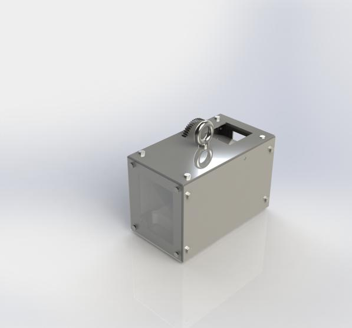

**Appendix A: Team Organization**

##Communication Procedures

1. Meetings are preferred in person to discuss the objectives of the project as well as future meetings in advance. Texting group chats will be the primary form of communication. Discord will be used as the secondary form of communication. 

2. (Jedriq Ventura) is the designated communicator between his group and the instructor. He will relay messages from the instructor and write down what was relayed to him, then transfer the information via text or in-person to the group members. As well using discord to communicate information between members. 

3. Contingency plan for the project’s success would have each subsystem assigned a ‘secondary’ partner that can help in case of problems that may arise.

##Meeting Schedule
 *Table 12*
 *Meeting Schedule*

##Team Coordination

1. We will use text messages or text-group chats to remind ourselves of the meetings and the time they will occur.

2. If the event of a time change is to occur, we will notify via text messages, or use discord messages if the individual cannot be reached via text message. 

3. The preferred format of the meeting would be in Person and or communicating via discord.

4. If the meeting is cut-short or has ended earlier for a group member that had a prior engagement in another group or school-related activity, we as the attending members will summarize the topics discussed and relay the information back to the group member in a timely and orderly manner, this can be done either via text or email documenting.

**Appendix B: Final Design CAD Model**

**Appendix C: Microcontroller Selection**

