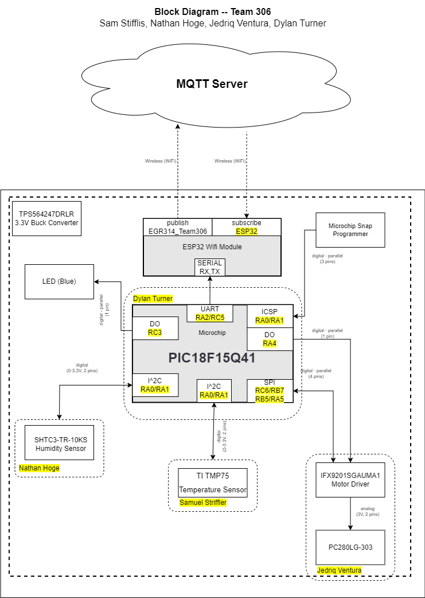

**Block Diagram**

The block diagram’s construction began with the fundamental understanding that two digital sensors, a motor driver with a motor, a wifi module, buck converter, and microcontroller. Starting with the microcontroller, our team chose the PIC18F15Q41 due to its ability to do both I2C and SPI while being programmable with MPLAB X. Two sensors, humidity and temperature, are connected to the microcontroller via I2C as it’s communication through 2 pins. A motor driver is connected through SPI communication through 4 pins. The motor driver talks directly to the motor, telling it to either stall, go counterclockwise, or go counter clockwise. The microcontroller is connected to the ESP32 wifi Module which allows for the microcontroller to talk over wifi and to program the microcontroller itself. 

*Fig. 14  Block diagram*
