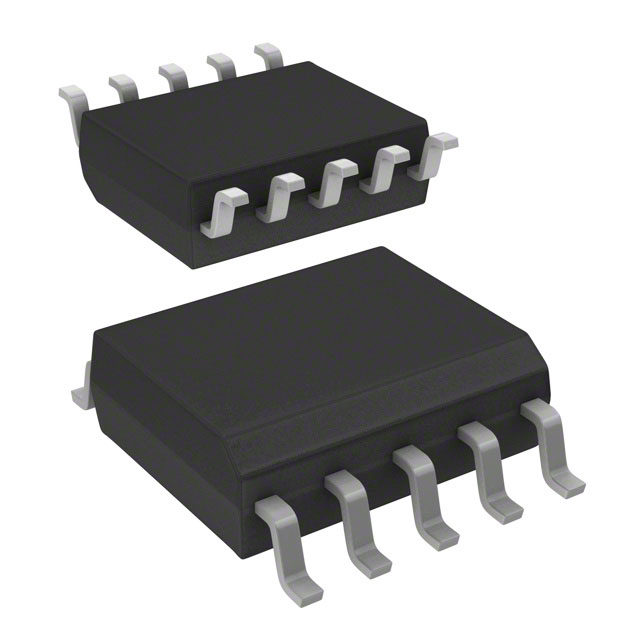
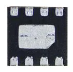
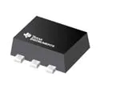

Motor Driver
Team Member: Jedriq Ventura
Component:
Pros:
Cons:
DRV8220DRLR

| Component     | Pros                                                                                  | Cons                                                       |
| ------------- | --------------------------------------------------------------------------------------|---------------------------------------------------------   |
| DRV8220DRLR / Price: 0.93  | 4.5-V to 18-V operating supply voltage range                           | Features of the pins do not allow it to be easily soldered on|
|Vendor:Texas Instruments   | Multiple interfaces for flexibility and reduced GPIO                                  |Limited towards PWM interface                   |
| ------------- | --------------------------------------------------------------------------------------|---------------------------------------------------------   |

| Component     | Pros                                                                                  | Cons                                                       |
| ------------- | --------------------------------------------------------------------------------------|---------------------------------------------------------   |
| A3909GLNTR-T / Price 1.50 | Overcurrent protection, Output to supply short, Output to GND short, Output load short|Priced excessively high for its quality         |
| Vendor: Allegro Microsystems  | Drives two DC motors or single stepper motor       |Uses Logic interface and does not indicate the use of SPI or I2C               |
|  | --------------------------------------------------------------------------------------|---------------------------------------------------------   |

|Component   |Pros                                                                                       |Cons
|------------|-------------------------------------------------------------------------------------------|------------------------------------------------------------|
|IFX 9201 GAMMA1/ Price: 2.18|Supports 1.8-V, 3.3-V, and 5-V logic inputs • Integrated current regulation|Power dissipation and thermal limits must be observed|
|Vendor: Infineion Device|Drives two DC motors or single stepper motor|Limited amount of Motors are compatable with this|                             
|            |Small package and footprint    |Limited to only SPI and PWM communication                                 |

|Components |Pros |Cons |
|---------------------------------|-----------------------------------------------|------------------------------------------------------------------------------|
|BD6211F-E2/ Price: 2.30 |power supply voltage range of 3.0V to 5.5V, with output currents of up to 2A |Specifies that it has an On/Off interface |
|Vendor: Rohm Semiconductor |highly efficient H-bridge driver ICs facilitate low-power consumption design |Limited communication channels provided |

Final Selection: IFX 9201 GAMMA1
Rationale: For the motor driver the optimal solution is the IFX 9201 GAMMA1. It has acceptable range with its power, and numerous fail safes that allow for continued use under certain circumstances if more power is to be imputed or outputted. It also uses the correct digital interface used that is part of the project. As well as this is the same motor driver used within the class and has all the key features within this part that allow for the best comprehensive performance. This was the best choice overall. 

Motor
Team Member: Jedriq Ventura

|Component  |Pros |Cons |
|-- |---------------------------------------------------------|---------------------------------------------------------------- |
|ROB-11696/ Price: 2.10|Used within the most basic of devices |Handle a Max of 12VDC even though descriptions states 3VDC                                 |
|Vendor: SparkFun Electronics|Simplistic in design and setup |Voltage cannot exceed more than 3VDC, but has been noted to take in 12VDC from the supplier |
|                            |                               |Locked-current set at 0.8A                                                                  |

| Component|Pros |Cons |
|--|--|--| 
|ASJGA12-N20/ Price: $15.90 |12VDC max voltage |Large gearbox  |
|Vendor: Aslong Motor |3,000 RPM |Open gear |

|Component |Pros |Cons |
|-- |-- |-- |
|PC280LG-303/ Price: $10.08 |Rated voltage is DC 6V |Information in regards to this motor is limited to only its performance |
|Vendor: Harfington |the gearbox part is 23mm in diameter and output speed of 100 RPM |Designation towards air pumps, is limited due to its size |

|Components |Pros |Cons |
|-- |-- |-- |
|NF123G-302/ Price: $5.64|Vendor: Johnson Motor, High Voltage input of 9V  |High priced motor compared to the others that have more positive aspects |
|Vendor: Johnson Motor |Can run between 3V-9V |Motor,Rated Voltage, DC 6V;Rated Current,  60MA |

Final Selection: PC280LG-303
Rationale: The best component found for the motor was the PC280LG-303 from Johnson motor. This motor will allow for movement within our project to perform more efficiently. This is also a very effective motor in terms of its cost. Its size and its performance being just powered by 3VDC overall made this the best option.

Temperature Sensor
Team Member: Samuel Striffler
Component:
Pros:
Cons:
|Component |Pros |Cons |
|--|--|--|
|Texas Instruments TMP75B-Q1/ Price: $2.04 |Designed for an industrial application |Not as accurate of a sensor reading (+/- 1.0℃) |
|Vendor: Mouser |Simplistic circuitry required for operation | |
|               |12 Bits of Resolution | |
|               |Lower cost | |
|               |Uses I2C interface | |
| |Low current (10µA)| |

|Component |Pros|Cons|
|--|--|--|
|Texas Instruments TMP107-Q1 / Price: $4.94  |Very accurate temperature reading (+/- 0.4℃) |Utilizes UART interface |
|Vendor: Mouser |Wide temperature reading range (-40 to +125℃) |Elevated cost over other sensors |
| |Designed for an HVAC application, which is closely applicable | |
| |14 Bits of resolution | |
| |Extremely low current (1µA) | |

|Component |Pros |Cons |
|--|--|--|
|Texas Instruments TMP105YZCR/ Price: $2.39  |Utilizes I2C Interface |Very loose accuracy of sensor (+/- 3.0℃) |
|Vendor: Mouser |Adjustable resolution from 9 Bits to 12 Bits | |
| |Lower Cost sensor | |
| |Wide input voltage range (-0.5V to 7.0V) | |

|Components|Pros |Cons |
|--|--|--|
|Analog Devices ADT7422CCPZ-RL7/ Price: $8.07 |Highest Resolution (16 Bits) |High Cost ($8.07 compared to next highest at $4.94) |
|Vendor: Mouser |Extremely accurate temperature reading (+/- 0.1℃) |High current usage (265µA) |
| |Fast power up (6µs) | |
| |Utilizes I2C Interface | |
| | | |

Final Selection: Texas Instruments TMP75B-Q1
Rationale: It provides the best middle ground on all important aspects that are used to evaluate the sensor. It has acceptable temperature reading error range, a relatively low cost, decent resolution, relatively easy circuit implementation, lower power need, and utilizes the correct interface for the project. While better sensors can be purchased, this offers less areas for failures in the circuitry, and provides more than adequate output to portray relevant information for the end user and to trigger the venting function we want to implement in our weather station design. 

Humidity Sensor
Team Member: Nathan Hoge

|Components |Pros|Cons|
|--|--|--|
|ENS210-LQFM Humidity and Temperature Sensor/ Price:$3.18  |One of the cheapest available options |Low range for operating temperature |
|Vendor: Digikey |I^2C |WDFN package type (difficult to solder by hand) |
| |Low response time (3s)| |
| |Within 3.3V supply | |

|Components|Pros|Cons|
|--|--|--|
|HPP845E131R5 Humidity and Temperature Sensor/ Price:$6.16/each |I^2C |More expensive than other options on list |
|Vendor:Digikey |SOIC package type (easier to solder by hand) |VDFN package type (difficult to solder by hand) |
| |Most expensive option for measuring humidity | |
| |Highest deviation in humidity reading accuracy | |
| |Outside of 3.3V supply | |

|Components |Pros |Cons |
|--|--|--|
|SHTC3-TR-10KS Humidity and Temperature Sensor / Price: $3.04/each |One of the cheapest available option One of the cheapest available option |High response time (8s)|
|Vendor: Digikey |Lowest deviation in humidity reading accuracy |WDFN package type (difficult to solder by hand) |
| |I^2C | |
| |Within 3.3V supply | |
| |Short manufacturing lead time | |
| |Large range for operating temperature | |
| | | |

Final Selection: SHTC3-TR-10KS Humidity and Temperature Sensor
Rationale: The rationale behind choosing the SHTC3-TR-10KS Humidity and Temperature Sensor was due to the sensor adequately reaching all the hard requirements while having very few disadvantages. The sensor is able to properly use a 16b output with its humidity readings being fairly accurate. In addition, it is able to use I^2C to speak to the MCU and stay within the 3.3V supply of all other subsystems used. Its only real downside is its high response time at 8 seconds, but that can be overlooked as it’ll just take a lil bit more to properly update.
Switching Regulator
Team Member: Dylan Turner

|Component |Pros |Cons |
|--|--|--|
|MAX17626ATA+T/ Price: $1.45  |Simple looking design, and will be easy to use. |No side panels makes continuity harder to check |
|Vendor: Mouser |2 Amp output  |8 pins for that package type makes it harder to tell what's wrong with it. |
| |Wide operating a temperature that mirrors sensors (-40 to 125℃) | |
| |Low power dissipation (937.9mW) | |
| | | |

|Component |Pros |Cons |
|--|--|--|
|TPS564247DRLR /Price: $1.29   |Higher rating step-down converter |Super small casing  |
|Vendor: Mouser |Can go up 16V  |Takes a lot of capacitors, according to the datasheet. |
| |High amp output 4 amps | |
| |Budget Friendly at $1.29 | |
| |Side clamps make surface mount easier | |

 

|Components |Pros |Cons |
|--|--|--|
|TPS63901YCJR/ Price: $2.50 |lowest amperage of the 400mA   |Low Amperage compared to other models (400ma) |
|Vendor: Mouser |The input is basically the same as the output, so if we choose 3.3V it will stay the same |Higher cost at $2.50 |
| |Texas Instruments has a very nice data sheet for it. |Sauder balls are just not preferred |

|Components |Pros |Cons|
|--|--|--|
|TPS63802DLAR/ Price: $2.50 |2 amp output |Higher cost at $2.50 |
|Vendor: Mouser |Is meant for lower voltages | |
| |Doesn’t take much space and seems like the footprint would be easy to make.  | |

Final Selection: TPS564247DRLR

Rationale: TPS564247DRLR because it has a high output amperage that can satisfy any current needs our motor may have. The footprint is conducive to soldering onto our group pcb, and all of these come at a very affordable price for our budget.

