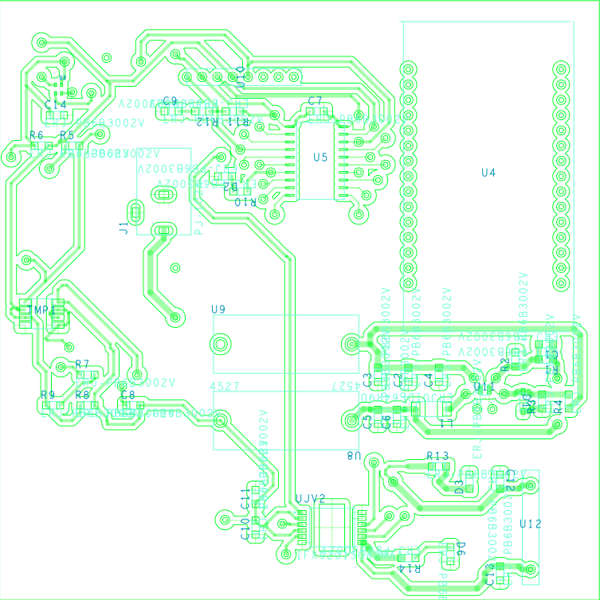

 # EGR 314 Team 306

 **Spring 2023**

 **Arizona State University**

 **Travis Kelley**

  
 

Our Team members are:
Jedriq Ventura, Sam Stiffler, Nathan Hoge, Dylan Turner

This Website will follow our 314 course, and will highlight our assignments.

Below you will find our relevant links and Assignments ↓↓↓

[**Our Team Introduction**](Introduction.md)

## Team Charter

### Charter
  
  - Produce systems that can respond to the environment using serial sensing and
    actuation.

  - Being able to produce a network of digital sensors and being able to apply that
    data.

  - Being able to make a complex system in a mobile/carry-on fashion

  - A system of subsystems that will actually integrate with one another, and allow
    for communication between the systems.

  - We will work on a system of productivity to ensure deadlines are met.

  - We will have an interdependency system between team members for each
    system. This will entail a main and secondary person on each subsystem.

  
### Mission Statement

Our team is tasked with making a mobile weather station, with applications of at least two
sensors, switching regulator, and motor articulation dependent on sensor input. Success in this
project will rely on our understanding of our device, and its several parts even though it’s
assigned to one member, each member should have some hand in helping between integration
and overall device readiness of its subsystems. Success will be measured through creation of a
robust, high quality device with straightforward and convenient operation for the end user.

[**Assignment (User Needs and Benchmarking)**](User-needs.md)

## Introduction 

The team is currently constructing a mobile weather station that would allow production of  systems that can respond to the environment using serial sensing and actuation.  

# Objectives

The mobile weather station should prove a major challenge and through this, we will be able to create a small PCB that has all surface mount parts, using a variety of soldering techniques. This will also be a coding challenge and learning python will be necessary. We hope by the end of this project to have efficiency in both. The code will be needed to make the integration of the microcontrollers and analog sensors seamless and hopefully have a project that self actuates based on the read data. 

## Stakeholders

**Item 1: Logia 7-in-1 Wi-Fi Weather Station with Solar Indoor/Outdoor Remote Monitoring System, Temperature Humidity Wind Speed/Direction Rain UV & More, Wireless Color Console w/Forecast Data, Alarm, Alerts**

	

[Search: “Mobile Weather Station”](https://www.amazon.com/Logia-Monitoring-Temperature-Humidity-Direction/dp/B0BD68C3W5?th=1)

Price: $159.99

Vendor: Amazon

### Positive Comments:

“The first time I went through this it probably took me half an hour because I did it piece by piece, including setting up my Wunderground account, while carefully reading the directions. If I was to blank it out and start over, it would take me less than five minutes now.”

“ The instructions were clear and the sequence for setup ensured that it worked the first time! The outdoor unit was very easy to mount on a pole, and the indoor monitor provides comprehensive and accurate information.”

“I love this weather station but it’s a small but, the set up was a little confusing but if you take your time and be patient you can get through it. Because I live in Canada I had to change everything to Celsius and kilometers per hour on the wind function.”

### Pros:
- Many different sensors to cover a wide array of data
- All conveniently displayed on one screen
- Wireless sensors that connect to a main hub
- Straight forward functionality once setup is complete

This weather station is feature packed with a wide array of sensor options for the end user to utilize. These sensors are all conveniently put on one display for the user for maximum convenience.

### Negative Comments:

“I found that setting up the clock on this unit was by far the most difficult and also the most critical for other functions such as moon phase and sun rise sun set”

“Wind-speed spinner no longer measures wind speeds as it's bearing seems to have worn out. The 1 year warranty has only just expired a month ago”

“The display console also has it's drawbacks. While cool looking with lots of data, the display keeps the same light level all the time. You have to manually change the brightness on the back of the device. “

### Cons:

- Has issues with connectivity
- Sensors don’t give outputs
- Common parts failures in moving parts
- Poor Screen quality

This weather station does not have the best reputation for quality of individual components with many people reporting failures. Connectivity between sensors also seems to be a common theme between end user experiences, and while the screen does have to display a lot, it does so with poor quality.

 
	
**Item 2: AcuRite Iris (5-in-1) Professional Weather Station with High-Definition Display, Built-In Barometer, and AcuRite Access for Remote Monitoring and Alerts, Compatible with Amazon Alexa, Black (01151M)**

 
	

[Search: “Mobile Weather Station"](https://www.amazon.com/AcuRite-Weather-Station-Monitoring-Compatible/dp/B07CBFNG3P)

Price: $215.99

Vendor: Amazon

Description : The acurite Iris weather station. Is an easy to access and easy toread display. It is able to have a  Weather Overview dashboard,that receives readings of outdoor temperature, humidity, wind speed and direction, barometric pressure trends, and rainfall total.

### Positive Comments:

“Just what I was looking for. It’s so much easier to read and change screens. The description showed NO batteries. I know it is solar, so didn’t think I needed any.”

“Overall a great system, easy to set up, works well. With this newer version with higher quality display, indoor temperature is on a separate screen which you need to either toggle to through the display menu, or put into a multi-screen auto-cycle”

“he Acurite system checked all the boxes for me including WU connectivity, programming from my phone and the ability to connect through a metal roof, etc. by having the add-on signal repeater that can insure a strong signal.”

### Pros:
- High definition display allows it to be viewed in many angles
- built-in sensors that measure barometric pressure, along with indoor temperature and humidity
- captures relevant weather data reliably

The weather station is very compliant and compact. It arranges large sets of data gathered into a small yet legible screen display. The built in sensors allow for readings without interference from other parts nor the casing the sensors are in. This allows for a smoother collecting of data being gathered.

### Negative Comments:
“To orient the photovoltaic cell correctly in the Southern hemisphere it needed to be facing North instead of South, so I needed to reposition the wind vane 180 degrees because there is no software setting to do this.”

“Sometimes inaccurate. Slow to react or freezes; during gusty, changing winds it will show one wind speed for up to 30 minutes”

“Ordered an Acurite weather station through Amazon Australia, as it was through the Australian branch I expected the power plugs to be Australian not US, the unit also does not have Australia as a time zone only the US. Very disappointed”

### Cons:
- Has a negative reaction when placed near coastal areas
- Slow reaction to below freezing weather and gusty storm winds
- Certain parts delivered in a certain country may not be as effective

The weather station has many faults towards its transportation of parts and manufacturing aspects. The parts given seem to not all be universally the same and overall, it seems that depending on where you order from certain aspects of its power source change as well.

**Item 3: La Crosse Technology S81120-INT Wireless Combo Weather Station with New Breeze Solar Wind Sensor, Black**

[Search: “Mobile Weather Station Moving Solar Panel”](https://www.amazon.com/Crosse-Technology-S81120-INT-Wireless-Weather/dp/B084NXZQSS)

Price: $137.95

Vendor: Amazon

Description: Solar-Powered Mobile weather station capable of recording wind speed, wind direction, temperature, and humidity. Connected to Wireless display to view all previously mentioned measurements.

Item 3 Pros and Cons based on feedback

### Positive Comments: 
“I got this handy weather station as a gift for my husband. Now we are all enjoying it as we can see information for the temperature both inside and outside the house. It also tells humidity which is handy in the winter. We live in a windy area so it is fun to see just how fast the wind is blowing. It also gives the wind direction. It is easy to mount outside the house on a post and is solar powered so you don't need to change the outside batteries. This was an inexpensive and handy purchase that is lots of fun to use!”

### Pros:
- accurately reads data without exposer to elements

- keep the device inexpensive to reach a wider consumer base

- easy to setup

### Negative Comments:
“This unit worked for awhile then the outside sensor would work intermittently...
So I replaced the ML2032 battery (fully charged) and the sensor is still intermittent...
And of course I can't return it to Amazon as I am past the return date.
This is the second time that I purchased a La Crosse Technology device and was disappointed.
It ended up in the trash…”
       

### Cons:

- spotty readings that weren’t consistent

- issues with battery connection or solar power

- the unit’s life span is farely short

**Item 4: EXTECH Wireless Weather Station**

	

[Search: “Weather Station”](https://www.amazon.com/Extech-WTH600-KIT-Weather-Station-Kit/dp/B076CK7VFX)

Price: $149.99

Vendor: Amazon

Description: WTH600-KIT is a professional weather station with integrated 5-in-1 sensor. The wireless 5-in-1 sensor contains a self-emptying rain Collector for 
measuring rainfall, Anemometer, wind vane, temperature and humidity sensors. It is fully assembled and calibrated for your easy installation. It sends data by a low 
power radio frequency (915MHz) to the display main unit up to 450 ft (150M) away (line of sight). The main unit also displays indoor temperature/humidity, Dew point, 
and Barometric pressure.

“Finding this not so common part was a breeze. I hope the two day shipping is legit. Thanks irregardless.”

“Best price, easy to order, always been good in the past”

### Pros:
- The device has an easy to read display, with all info present.
- The weather station has more than one sensor and data is provided.
- Easy to setup and remove.

This Device is easily set up, and doesn't fly away. The data is readily available, and easy to read. The device comes with a remote that gives data, so you don't have 
to be near it. 

“I never had issues before with GTS. This time I did contact support to confirm and be sure of the choice, but this little issue put me in a lot of troubles.”

“Gary, we use a flat rate shipping fee per State on orders under $99; orders over that amount, we can offer free ground shipping. We understand it is isn't always 
ideal,"

### Cons: 
The quality needs to be there, when considering moving parts, it's best to know its limits and design accordingly.
Plastic housing is fine, but it's also important to keep in mind that this station is meant to be outside so problems like plastic erosion is possible when left out 
long enough. 
This wind sensor is notorious for not being accurate, and a better look at bearings is important if implementing anything like it on the device.
Battery life should be long on a device like this because it's meant to be posted up, wall power or anything like it should be considered if it can be left alone.

This device was made for the outdoors but fails to prepare for that. The plastic isn't resistant to the sun, The bearings can’t handle always being in motion. 

**Item 5: Tempest Weather System with Built-in Wind Meter, Rain Gauge, and Accurate Weather Forecasts, Wireless, App and Alexa Enabled**

	
	

[Search: “Weather system”](https://www.amazon.com/Tempest-Weather-Accurate-Forecasts-Wireless/dp/B0868WY7NY/ref=sr_1_1_sspa?gclid=Cj0KCQiA_bieBhDSARIsADU4zLe3j_PnEjA8I7rkHx6TjKhfbAyVQtHS_wYX5ZRrjvAn8R0PdqrMwOYaAp_KEALw_wcB&hvadid=616989246422&hvdev=c&hvlocphy=9030087&hvnetw=g&hvqmt=e&hvrand=8983508297000195&hvtargid=kwd-857085239451&hydadcr=15280_13597137&keywords=tempest+weather+station&qid=1674515775&sr=8-1-spons&ufe=app_do%3Aamzn1.fos.c3015c4a-46bb-44b9-81a4-dc28e6d374b3&psc=1&smid=A3RAYC554RKGF9&spLa=ZW5jcnlwdGVkUXVhbGlmaWVyPUEyOElBTFdWUFpSU1lNJmVuY3J5cHRlZElkPUEwMDg1NTMzMzk5RlZEWVZPR0hXUSZlbmNyeXB0ZWRBZElkPUEwODI1NzY5MVJNQk04U1BISks2VCZ3aWRnZXROYW1lPXNwX2F0ZiZhY3Rpb249Y2xpY2tSZWRpcmVjdCZkb05vdExvZ0NsaWNrPXRydWU=)

Price: $329.00

Vendor: Amazon

Description: As featured in the Wall Street Journal, CBS Innovation Nation, Bob Villa and Wired, Tempest reports temperature, solar radiation and UV, humidity, 
barometric pressure, wind speed and direction, dew point, lightning strikes, rainfall and more.

### Pros: 

- Controlled via an app

- App has all data collected by device

- Device is not internet reliant, and can be connected to via bluetooth as well

- Super easy set up

- Much more compact than other models.

### Cons:

- Battery life is not there, charge could take hours, because its solar powered, and runs out quickly

- Data is processed so unsure if its giving accurate reading

- when disconnected from wifi can’t update

- Quality can’t withstand the weathering

### Stakeholders
- Target Group
- Home botany enthusiasts
- Small batch farmers
- Terrarium enthusiast
- Biology teachers
- Reptile owners/Zoos

### External Partners
- Arizona State University
- Professor Travis Kelley
- EGR314 Teaching Team
- JL PCB
- Mouser
- Digikey

# User Needs

## Notes

### Raw Notes

### Ranked Notes

# Our Process

Our team began brainstorming by committing 10 minute intervals to write down every idea that came to each team member. Our team then compiled all the ideas and 
compared each other to make sure there was no overlap. Once that was complete, our team compiled it all and began to sort by what our team deemed as a priority, 
important, would like, or not practical. 
	
# Requirements

### User Cases

	
### Use case #1: 

Our target end user would be a gardening hobbyist who wants to grow their own plants, and does so with a small greenhouse or enclosed space. This person would benefit 
greatly from being able to control as many aspects of their plant environment as possible. This is not a full sized greenhouse growing space that our end user would 
have access to, so there isn’t the level of advanced control as a full sized space. Our user would benefit from a small weather station to monitor their greenhouse, 
and depending on their plants, change where they want their temperature. This would be greatly met by a mobile weather station to monitor temperature and humidity, and 
have the ability to control where they want those to sit via an external vent that can be opened to bring that space back to the desired point.

### Use case #2:

Our target end user would be a farmer who wants to tend to their own crops and livestock. This individual would benefit from a mobile weather monitoring device by 
being able to monitor the outside environment to make choices on how to take care of their crops and livestock. Being able to monitor the outside temperature allows 
farmers to figure out when crops and livestock might experience temperatures outside their appropriate temperature range and properly adjust accordingly. Being able to 
monitor the humidity of crops will allow us to figure out the moisture loss from crops and give the farmers an idea on when to properly water their crops.

## Design Aspects

	
## Hardware

- This project must utilize a professionally manufactured pcb board. (E)
- This project must use surface mount components for its electrical circuits.(E)
- This project must incorporate the pic18f chip to control all aspects.(E)
- This device will use a switching regulator for a main source of power.(E)
- This project must have its own power source or utilize an everyday power source. (L)
- This project must be able to go two days without a charge if utilizing an internal power source. (L)
- This project, if utilizing an internal power source, must have the ability to use a common charger or internally charge. (L)
- This project should have fuses, and other fail safes in case of a surge. (L)
- This project must utilize minimal specialty hardware in its design. (L)
- This project will include external usb ports.(E)

## Software

- This project will have seamless integration. (L)
- This project will have an automatic override (If this… then restart) (L)
- This project will have data collected and used.(E)
- This project will include auto leveling.(E)
- This project will be able to switch units of measurement (metric to imperial, celsius to fahrenheit) (E)
- This project will have reactions to different environments. (L)
- This project will have parameters set by the user.(E)
- This project will have a control app.(E)

## Interactivity

- This project will have parameters set by the user.(E)
- This project should be portable. (E)
- This project needs to be able to be in different climates. (L)
- This project will have an app for the user.(E)
- This project will display all sensor data.(E)
- The motor, sensors and power supply will all run in unison. (L)

## Customization

- This project will be submerged.(E)
- This project will be able to be buried.(E)
- This project will be able to be suspended.(E)
- This project will be able to slip out of its cover to another one.(E)
- This project will include external usb ports.(E)
- This project will have a variety of uses. (L)

## Manufacturing

- This project must be built within a total budget of 240 dollars.(E)
- This project should be portable.(E)
- This project will have an articulation component.
- This project must be serviceable for continued operation.(E)
- This project must have longevity when it comes to functionality of parts and systems. (L)
- This project must demonstrate weatherproofing.(E)
- Must be able to hold up to almost any environment the average consumer may use it for. (L)
- This project must incorporate cad controlled models for manufacturing. (E)
- This project must be of a compact size not to exceed 1 cubic foot. (L)
- This project must have a streamlined manufactured quality. (L)
- This project must be easily remanufactured. (L)
- Has to be not cumbersome when being transported or moved either on its own by an outside force. (L)
- This project must utilize a robust frame to promote longevity. (L)
- Components of this project must be secure inside the overall device and unable to move excessively.(E)
- This project must be easily assembled.(E)
- This project must have a weight of less than 10 pounds. (L)
- This project must be able to incorporate a vent into its design. (L)
- This project must be easy to disassemble.(E)
- This project must be able to pass a 6 foot drop test.(E)
- Sensors would be strategically placed all around the device's body allowing for optimal areas of access.(E)

## Safety
- The device should be padded and have no sharpness to ensure minimal injury.(E)
- The device should be made in a way to ensure that the user is nor harmed when handling the device. (L)
- This project must have a failsafe if large objects make contact.(E)
- This project will not blow up.(E)
- This project must be able to be partially buried.(E)

## Milestones
### Project Checkpoint 1 - 1/23

### Project Checkpoint 2  - 2/27-3/1

### PCB manufacturing done by - 3/3

### Hardware implementation by - 3/3

### Software and body made by - 4/20

### Project Checkpoint 3/Innovation Showcase - 4/28

# Resources
	

“How to write a product requirements document (PRD) - with free template,” Formlabs. [Online]. Available: https://formlabs.com/blog/product-requirements-document-prd-with-template/. [Accessed: 22-Jan-2023]. 

[**Assignment 3 (Design Ideation)**](Design-Ideation.md)

### Assignment 3
## Generation of Concepts

# Raw Concepts

# Grouped Concepts

# Ranked Concepts

## Product Concept Sketches

# Concept 1

This is our 1st concept of the Mobile Weather station. This is our bare bones of what we want in terms of mobility and design, This would be a simple pill device that 
would house the necessary parts that would be included in the device. Such as the brush motors, and a 3.3V power supply. The overall design was open ended, but my main 
inspiration for this was certain weather probes that have a very cylindrical or pill shape which allows for minimal wind resistance and overall protection of the 
device if it ever encountered outside damage.

# Concept 2

In our second concept design, we propose utilizing a box shaped hanging weather station. This will utilize a rechargeable and replaceable 3.6v battery platform 
for power. It will monitor temperature and humidity actively, and vent to the atmosphere to regulate internal temperature and humidity for our end user based upon 
their settings. It will showcase a welded steel frame that will be line-x coated for superior durability. It will have a lexan window encasing the electronics that 
will be removable to change batteries, and access all electronic components for any necessary maintenance. On the weather station, simple controls for operation will 
be located such as power, reset, and accompanying them will be a status led for the weather station depending on which mode it is in (open or closed). It will have the 
ability to be hung by incorporating a braided steel cable from the top. It uses an internal duct to house the sensors that are actively monitoring their respective 
data. At the top of this duct will be a door that opens controlled by a simple 3.6v brushless motor. This door will allow the vent to go into a form of ducting that 
will connect the weather station to the atmosphere. This ducting will be completely removable and work in conjunction with the weather station.

# Concept 3	

This design was based on the idea of a “thermometer” on a stick. Using the arm pictured above the device would send a signal out to the motor which would swing the arm 
back and forth. This would be the starting point for our readings, and when the arm stops will be the ending of our readings. The box would be the main housing for the 
electronics. (This will store the Battery, Regulators, and Motor.) Our sensors are located on the end of the arm. This idea is meant to be placed down like in a garden 
or greenhouse, and you could get readings at any point from something like your phone. You would be able to send a signal from an app or something which would tell the 
motor to do a swing and take a measure. The measurements given back to you would give you temperature and humidity readings.

# Our Process
  
  
  
 We had each put some contribution in each of the designs but each design can be credited (in order) to 1 Jedriq Ventura, 2 Samuel Stiffler, 3 Nathan Hoge. Dylan made the contribution of explaining our ideas, and getting them onto the github.
 
 For brainstorming we had given a couple thoughts based on what we had seen in the previous user needs assignment. Concept one was a pill 
 shape that was wind resistant, and it would be super portable, it was based on the beats pill speaker. Concept 2 is a latern style 
 hanger, this was inspired by a humming bird feeder. This would be able to hang in any green house and stays in place collecting 
 information. Concept 3 was an off the wall idea of a "wagging thermometer" this would collect information by waving the arm and starting 
 the collection and ending the collection at the end of the arms path.

It was better to have the ideas but holding to them was way harder. Because we had to make choices based on what is and isnt important. For instance each device is suited for different environments, concept 1 would be on the go, concept 2 would be a hang and stay, finally concept 3 would be a place and sit.

[**Assignment 4 (Presentation Slides and Link**)](Presentation.md)

**Selected Design**

Final Choice

After deliberating between all group members, the final decision was made that design concept two would be the best option for 
the team to proceed with. This design in short will be a mobile weather station that will have active humidity and temperature 
readings which will move a door to an air vent with the intention of managing the environment within enclosed spaces. Ideal 
environments need to remain within a general desired temperature and humidity range for a variety of reasons.

Rationale

Our rationale for our decision was evaluated with respect to multiple factors. Each design was evaluated with respect to 
manufacturing, practical implementation, electronics, coding, and budget. Both design concepts two and three received high marks 
in terms of manufacturability due to the inherently larger sizes of them to implement power sources, electronics, and the 
mechanical aspects tied to our motor functions. Design concept one was not of a realistic size to implement our necessary 
components within its confides. Design two won on practicality as we evaluated that while all designs can give a good glimpse of 
the weather, design two could actually use its motor function and apply it to something more useful for an end user. As for 
electronics, we mainly looked at practical placement within the concept. Design concept one was so small that all sensors would 
be a struggle to place in any sort of ideal spot. Design concepts two and three were both higher scoring in this area due to the 
simple fact of size. They have the realestate to place the pcbs wherever they need to be in order to implement ideal positioning 
of the sensors. Evaluation of coding was mainly tied to the purpose of our motor in how we evaluated the concepts. Design two 
had the best outcome from this as it provided the most straightforward coding from a motor function based on sensor outputs. 
Budget for these was evaluated by what designs could implement the most standard components. Design one was very much hard to 
analyze so we did not evaluate it. Between two and three, two received the highest evaluation due to a simpler to make box as 
opposed to the enclosure of design three which would limit us to a lot of custom 3d printing with more exotic filaments to 
obtain necessary durability.

[**Assignment 5 (Block Diagram**)](Block-Diagram.md)

**Block Diagram**

The block diagram’s construction began with the fundamental understanding that two digital sensors, a motor driver with motor, a 
wifi module, buck converter, and microcontroller. Starting with the microcontroller, our team chose the PIC18F15Q41 due to its 
ability to do both I2C and SPI while being programmable with MPLAB X. Two sensors, humidity and temperature, are connected to 
microcontroller via I2C as it’s communication through 2 pins. A motor driver is connected through SPI communication through 4 pins. 
The motor driver talks directly to the motor, telling it to either stall, go counterclockwise, or go counter clockwise. The 
microcontroller is connected to the ESP32 wifi Module which allows for the microcontroller to talk over wifi and to program the 
microcontroller itself. 

*Fig. 14  Block diagram*

[**Assignment 6 (Component Selection**)](Component-Selection.md)

## Final Components
|PART INFO|RATIONALE|
|--------|---------|
|IFX 9201S GAUMA1 Manufacturer: Infineon Technologies Price: $3.86 Vendor: Digikey|For the motor driver the optimal solution is the IFX 9201S GAUMA1. It has acceptable range with its power, and numerous fail-safes that allow for continued use under certain circumstances if more power is to be imputed or outputted. It also uses the correct digital interface used that is part of the project. As well as this is the same motor driver used within the class and has all the key features within this part that allow for the best comprehensive performance. This was the best choice overall.|
|PC280LG-303 Manufacturer: Johnson Motor Price: $4.78 Vendor: Digikey|The best component found for the motor was the PC280LG-303 from Johnson motor. This motor will allow for movement within our project to perform more efficiently. This is also a very effective motor in terms of its cost. Its size and its performance being just powered by 3VDC overall made this the best option. |
|Texas Instruments TMP75B-Q1 Manufacturer: Texas Instruments Price: $2.04 Vendor: Mouser Electronics|implementation, lower power need, and utilizes the correct interface for the project. While betsensors can be purchased, this offers less areas for failures in the circuitry, and provides more than adequate output to portray relevant information for the end user and to trigger the venting function we want to implement in our weather station design.|
| SHTC3-TR-10KS Humidity and Temperature Sensor Manufacturer: Sensirion AG Price: $3.04 Vendor: Digikey |The rationale behind choosing the SHTC3-TR-10KS Humidity and Temperature Sensor was due to the sensor adequately reaching all the hard requirements while having very few disadvantages. The sensor is able to properly use a 16b output with its humidity readings being fairly accurate. In addition, it is able to use I^2C to speak to the MCU and stay within the 3.3V supply of all other subsystems used. Its only real downside is its high response time at 8 seconds, but that can be overlooked as it’ll just take a lil bit more to properly update.|
|TPS564247DRLR Manufacturer: Texas Instruments Price: $1.29 Vendor: Mouser Electronics|TPS564247DRLR because it has a high output amperage that can satisfy any current needs our motor may have. The footprint is conducive to soldering onto our group pcb, and all of these come at a very affordable price for our budget.|

**Software Implementation**

[**Assignment 9 (Software Implementation**)](Software-Proposal.md)

*Fig. 17  Software Proposal*

Based on Fig. 17, our device begins by initializing the system. This includes setting the hardware registers, resetting all internal variables, and establishing communication with the ESP32 and sensors. Once finished, the next step in the code is to enable interrupts. After that is done, the software code acquires the I2C addresses for both the temperature and humidity sensors and then writes out a byte to initialize both sensors. If no byte is returned, the code keeps trying until a byte is received from both sensors. If the byte value is acquired, the software then check the write out by the sensors. If either the temperature is below 80F and the humidity sensor is below 60%rh, the code tells the motor to spin clockwise, closing the vent. If either value exceeds the 80F or 60%rh, the code instructs the motor to drive counterclockwise, opening the vent. Once humidity and temperature drop below these values, the microcontroller will activate the motor to move clockwise, resealing the vent. This loop is monitored via UART which is sent out to both puTTY and MQTT.

## Top 5 Changes

1. The first change our team would implement would be to use proper I2C interrupts. Using proper interrupts would allow the code to run as smoothly as possible when talking with the I2C sensors.

2. The second change our team would make is to have higher integration with both sensors. As the code is, the only checked value is the temperature, with humidity being only as a readout. Having both integrated to the code to cause function would be optimal.

3. The third change our team would integrate would be the use of #define. Using this function would allow us as a team to streamline the constant call of the hexadecimal addresses to just simple letter phrases. 

4. The fourth change our team would pursue would be the proper implementation of MQTT. Having MQTT implemented properly into our code would allow us as a team to observe the ESP32 as it gathers information from our microcontroller. This is necessary because it’s a requirement for the course. 

5. The fifth change our team would implement would be the more prolific use of comments. Using comments would better log on what each block of code is doing or to what is expected out of the code. In addition, comments could help us in debugging on where the code could possibly be failing. 

## Version 2.0

Given a second chance, our team would want to implement more efficient code that would be able to run proper I2C interrupts. We realized too far into the project, that they would be necessary to the calling out to the sensors. We would also have liked to add a better UART interrupts as well. Going through the testing it was hard how to figure out how to talk to the micro controller. For instance, the Pickkit 4 is not recognized as a COM so you would have to transfer data to the ESP32, but you would have to know code to get something in the terminal in the first place. So it would have been better to add a button or some sort of input first in the code stage, or a better way to implement the debug led. The SPI was easier to understand, but also still no response on that end. We would’ve loved to see some integration of all the subsystems, but we couldnt get in contact with them in the first place, the SPI or the I2C. We wish we could’ve figured out why just because we spent so long on it. The different peripherals was what threw us off at first but if we were told the differences in clock settings it would have been helpful for like FOSC/4 and FOSC.

[**Assignment 10 (Hardware Implementation**)](Hardware-Proposal.md)

**Hardware Implemenation**

Fig. 16  Hardware Proposal

Microcontroller ESP32, and Switching regulator (Top Right)
	This part of the schematic includes the switching regulator, and microcontrollers. The device will be powered by the regulator TPS564247DRLR, which will aslo supply power to the PIC18F15Q41 and ESP32. The PIC will be programmed using the microchip Snap. The ESP32 module is used for WIFI access, and will be programmed using UART.

Temperature Sensor (Top Left)
	Receiving power from the switching regulator, this will be programmed using I2C. This will collect data inside the module. The info received will be in Celsius or Farenheit. This data will be sent back to the PIC microcontroller.

Humidity Sensor (Left middle)
	Receiving power from the switching regulator, this will be programmed using I2C. This will also be measured inside the module. The data will be collected in percentage. This data will be sent back to the microcontroller.

Motor Driver (Bottom Portion)
	Receiving power from the switching regulator, this will be programmed using SPI, The motor will receive information from the PIC18F15Q41 from the sensors, this will tell the motor when and how to move. The motor ideally will open the hatch on the module when the humidity and temperature get too high. The idea is that when cold air rushes in, it will lower both criteras and then the motor will close the hatch.

The team decided for a 7.6V 2S Lipo battery as a readily available and rechargeable power source. This battery has a 4500mAh capacity with a potential discharge of 1/25th of an hour. To get maximum current draw from the battery, simply the 4500mAh capacity multiplied by 25 gives a maximum draw of 112.5 Amps. Within our budget we only had one powered rail at 3.3V for our components. To achieve our desired 3.3V, 7.6V will be regulated down through the TPS564247DRL. The current usage of this switching regulator is only 0.12mA. Within our 3.3 volt rail, all components added together were less than a quarter of the potential current output of the TPS564247DRL at roughly 1000mA. This is a more than comfortable buffer for that entire rail. Total current usage between all components adds up to 837.19mA which is miniscule compared to the max amperage draw of the battery. Total battery life utilizing a single battery is a respectable 5.3 hours, but we may add a second battery in parallel to double that to something much more practical for the end user.

## Final PCB Schematic

Front Plane: 

*Fig. 18  Front PCB (Computer)*

Back Plane:

*Fig. 19  Bottom PCB (Computer)*

## Final Assembled Board

Front Plane:

*Fig. 20 Top PCB (Photo)*

Back Plane:

*Fig. 21  Bottom PCB (Photo)*

## Version 2.0

If we were to design a second version of our group pcb, we would focus on two areas, design, and manufacturing. The design would incorporate many things we learned throughout the course to make sure our board worked as intended and as efficiently as possible. One big thing we realized is that having vias between two ground planes to ensure the common ground is a large help. When having things go to ground, we would ensure the shortest ground connections possible for reliability. We would ensure all connections and add vias as emergency attachment points for all connections throughout the whole board. All these were troubles we faced on both group PCs which taught us a lot about troubleshooting design issues on the backside.

For manufacturing considerations, we definitely prefer to have the board made by JLPCB for trying to start with a high manufacturing quality board. This, we feel, provides the best chance for success. We also would have removed the sensor subsystems and attached them to a daughter board with the main purpose of being able to locate sensors where most practical and accurate. From there, just ensuring that we have ample solder usage for all headers would greatly improve our connections for all wires. Overall, it would really only be small tweaks to the overall design, but in combination, the team feels that the effect would be significant on the quality of the finished product.

A breadboard phase would be extremely beneficial for the project, and a good recommendation would be an optional solder mount of your own part (for the surface mount ICC), to encourage early order forms. 

**System Verification**

## Lessons Learned
1. We learned a lot about vias and their limitations in overall pcb design.
2. We learned about many important parts of the design layout of the switching regulator and TI application parts.
3. We learned the importance of trying to keep things as simple as possible for both functionality and assembly of the pcb.
4. Cadence has many advantages and very specific disadvantages that we learned to facilitate more efficient work through the project.
5. We had to familiarize ourselves with proper usage of flyback diodes when implementing them in our motor driver system.
6. Size matters on everything, the smaller the component the more trouble you’re going to have, and going slightly larger on traces may be a saving grace.
7. We learned through failure how to properly avoid pcb manufacturing troubles within the actual tolerances, dimensions, and layout.
8. A large, yet simple thing we became aware of was the importance of distance to ground and how that can affect the systems on a pcb.
9. We learned the importance of understanding necessary components for I2C communication and how they will affect coding.
10. We had to develop our understanding of the Thonny interface and how to make it accept new code when working with the ESP32.

## Future Recommendations
1. Try to mess with Cadence in one’s free time early into the course in order to try and gain a better base comprehension for future use.
2. Take time and research footprints of surface mount parts early into the course to understand the issues that must be addressed in the final design.
3. Focus on trying to have everyone work together on each subsystem as multiple pairs of eyes save a lot of mistakes and revisions.
4. Note the physical dimensioning of everything from electronic parts to the board to the motor to make the final project outcome go together more seamlessly.
5. Read all feedback and actively change the submissions as feedback is received. It allows for more forward progress on the project.

## Resources
“How to write a product requirements document (PRD) - with free template,” Formlabs. [Online]. Available: https://formlabs.com/blog/product-requirements-document-prd-with-template/. [Accessed: 22-Jan-2023]. 

[**Appendix (Other Relevant Links to the Project)**](Appendix.md)

